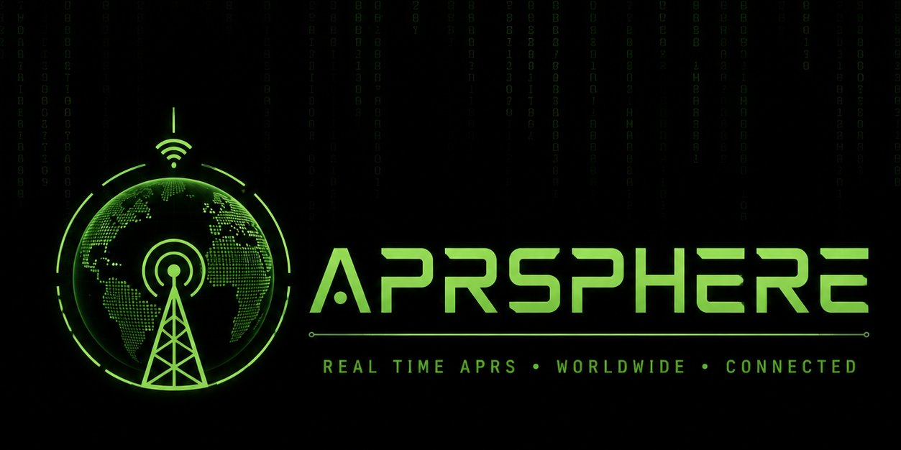
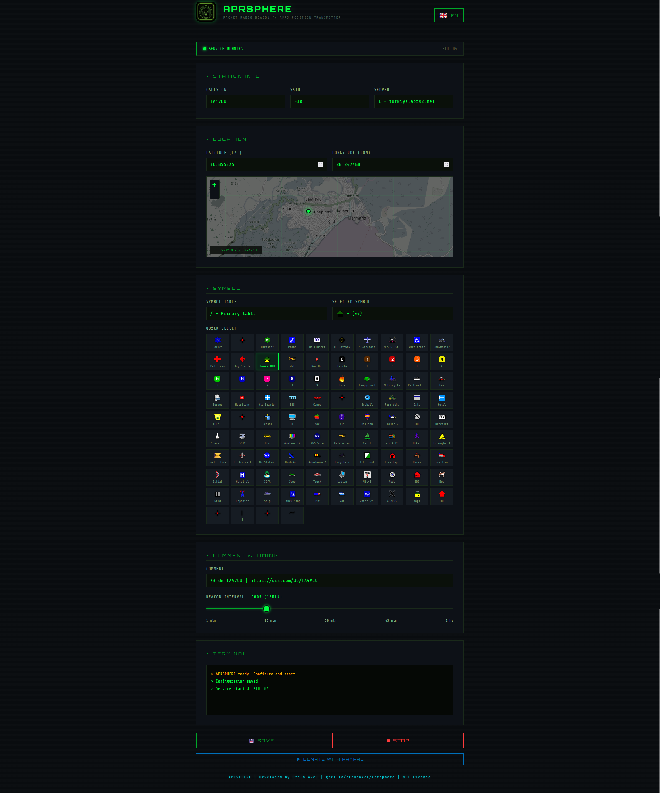

<div align="center">
  
  <br/><br/>
  <strong>APRS Static Position Beacon with Web UI</strong>
  <br/><br/>

  [](https://github.com/orhunavcu/aprsphere/actions/workflows/docker.yml)
  
  
  [](https://www.paypal.com/donate/?hosted_button_id=8QN5GXRJR7G8W)
  
</div>

---

## About

**APRSPHERE** is a lightweight, self hosted APRS static position beacon with a browser-based configuration panel. Configure your callsign, coordinates, symbol, comment, server, and beacon interval all from a dark-themed web UI with live map preview. No config files to edit manually.

---

## Features

- 🌐 **Web UI** on port `3169` — configure and control everything from your browser
- 🗺️ **Live map preview** — dark-themed OpenStreetMap with grid overlay
- 🇹🇷 **Turkey APRS server** — `turkiye.aprs2.net` as the primary server but you can choose any other different one.
- 🔣 **Symbol picker** — quick-select palette for common APRS symbols
- ⏱️ **Interval slider** — 1 minute to 1 hour
- 🐳 **Docker-first** — single `docker compose up` to run anywhere
- 🔄 **Multi-arch** — supports `amd64` and `arm64` (Raspberry Pi, Oracle ARM, etc.)
- 🔁 **Auto-restart** — container restarts automatically on failure

---

## Quick Start

```bash
curl -O https://raw.githubusercontent.com/orhunavcu/aprsphere/main/docker-compose.yml
docker compose up -d
```

Open **http://YOUR-SERVER-IP:3169** in your browser.

---

## Project Structure

```
aprsphere/
├── main.py                       # APRS packet transmitter
├── app.py                        # Flask web server & REST API
├── requirements.txt
├── Dockerfile
├── docker-compose.yml
├── templates/
│   ├── index.html                # Web UI
│   └── static/
│       ├── icon.png
│       └── logo.png
└── .github/
    └── workflows/
        └── docker.yml            # Auto build & push to GHCR
```

---

## APRS Servers

| # | Address | Region |
|---|---------|--------|
| 1 | `turkiye.aprs2.net` | 🇹🇷 Turkey |
| 2 | `euro.aprs2.net` | 🇪🇺 Europe |
| 3 | `noam.aprs2.net` | 🌎 North America |
| 4 | `soam.aprs2.net` | 🌎 South America |
| 5 | `asia.aprs2.net` | 🌏 Asia |
| 6 | `aunz.aprs2.net` | 🌏 Australia / NZ |

---

## Configuration

All settings are saved via the web UI. You can also pass environment variables directly:

| Variable | Default | Description |
|----------|---------|-------------|
| `SERVER` | `1` | Server index (1–6) |
| `CALLSIGN` | `NOCALL` | Your amateur radio callsign |
| `SSID` | `10` | APRS SSID suffix |
| `LAT` | `0.0` | Latitude (decimal degrees) |
| `LON` | `0.0` | Longitude (decimal degrees) |
| `SYMBOL_TABLE` | `/` | APRS symbol table (`/` or `\`) |
| `SYMBOL` | `-` | APRS symbol character |
| `COMMENT` | — | Beacon comment text (max 43 chars) |
| `INTERVAL` | `900` | Transmit interval in seconds (60–3600) |

---
## APRSPHERE UI


## License

MIT © [Orhun AVCU — TA4VCU](https://github.com/orhunavcu)
